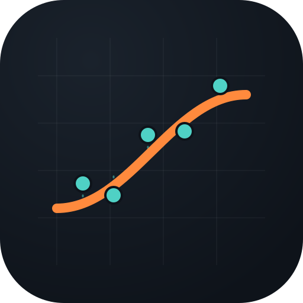

#  AI Function Matcher

This project implements an AI-assisted system for matching real-world test data to ideal mathematical functions. It uses regression techniques and structured data analysis to find the best-fitting function for each test datapoint.

🔗 [Project page](https://transfairs.github.io/ai-function-matcher/)

## 🔍 Purpose

The goal of the system is to:
- Analyse and visualise training, test, and reference (ideal) datasets.
- Identify the ideal function that best matches each test datapoint.
- Store results in a database and visualise them for further insights.

You can either run the system as:
- a **standalone Python script** (`main.py`), or
- interactively in **Jupyter Notebook form** via `main.ipynb`.

## 📁 Project Structure

- `main.py`: Entry point that orchestrates data loading, function matching, and result visualisation.
- `main.ipynb`: Jupyter-based equivalent of `main.py`, ideal for interactive exploration.
- `Research.py`: Analytical and exploratory module for deeper insights.
- `FileReader.py`: Handles CSV imports and data preparation.
- `Regression.py`: Performs ideal function matching using regression analysis.
- `Visualisation.py`: Creates plots to compare real and ideal data.
- `SQL.py`: Saves matching results to a SQLite database.
- `Testing.py`, `UnitTests.ipynb`: Contain automated tests – the notebook version allows step-by-step verification.

## 🧪 Input Data

- `train.csv`: Training data with known relationships.
- `ideal.csv`: A pool of idealised functions to compare against.
- `test.csv`: New test data to classify via function matching.

## 🧠 AI and Regression

Function matching is based on calculating regression-based deviations between test points and reference functions. The best fit is determined by minimal error across all candidates.

This approach lays the foundation for future enhancements such as:
- Polynomial or non-linear regression
- Neural networks for pattern recognition
- Confidence-based assignment

## 📊 Output

- Visualisations showing ideal/test function alignment
- Matching results saved in a local SQLite database
- Tabular outputs and console logs for traceability

## 🛠️ Installation

Make sure Python 3.9+ is installed. Install required libraries via:

```bash
pip install -r requirements.txt
```

## 🚀 Getting Started

Run as Python script:
```bash
python main.py
```
Or use the notebook:
```bash
jupyter notebook main.ipynb
```

## 🧪 Running Tests
Run tests via the Python test file:
```bash
python Testing.py
```

Or explore and verify logic step-by-step in the Jupyter Notebook:
```bash
jupyter notebook UnitTests.ipynb
```

## 📜 License
This project is open-source and licensed under the GNU General Public License v3.0. See the LICENSE file for details.


